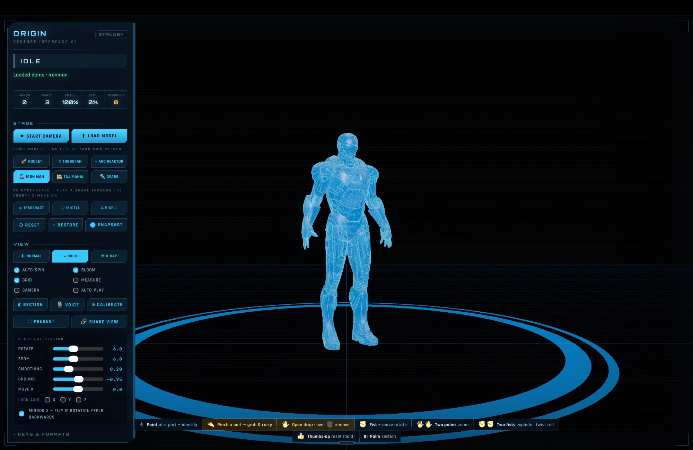
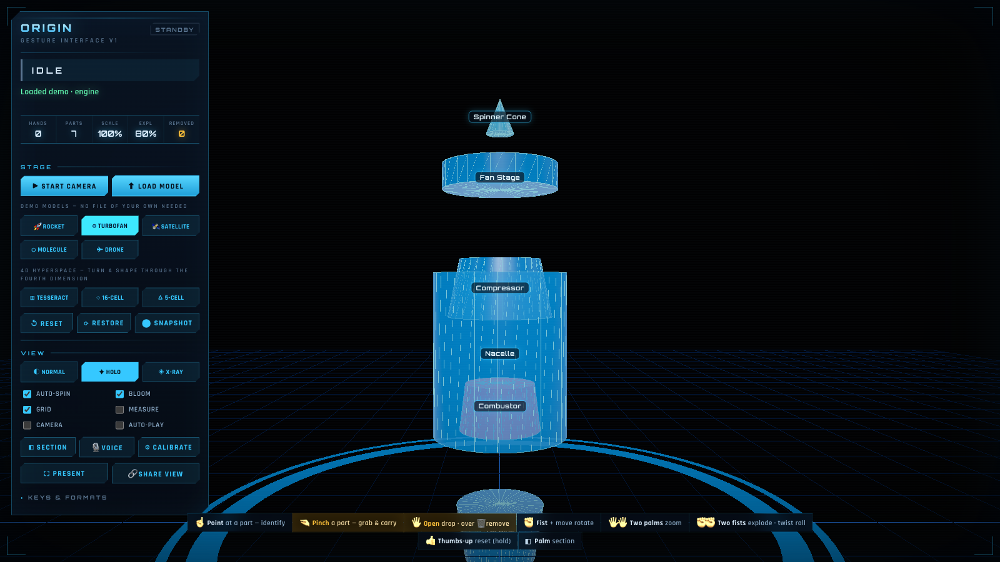
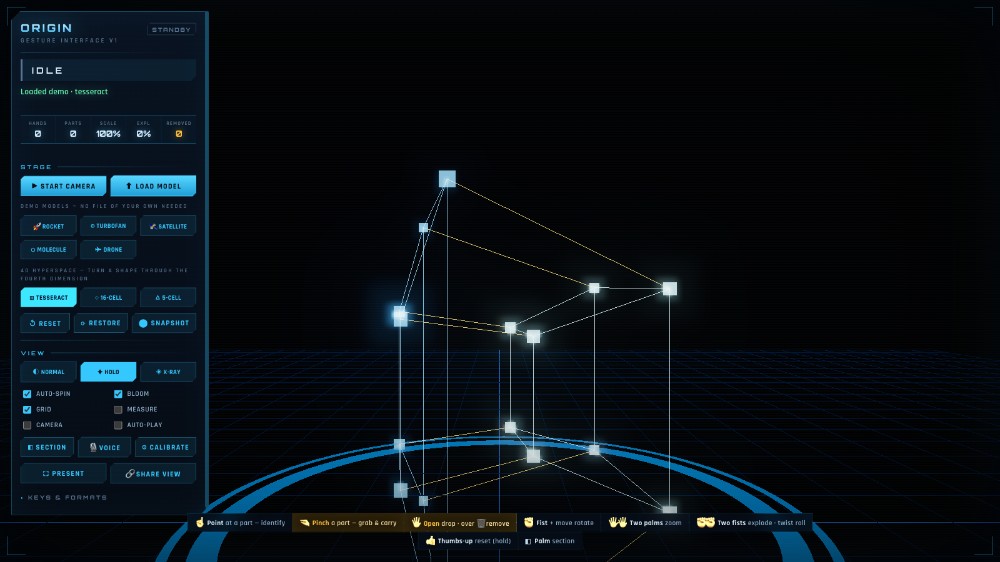
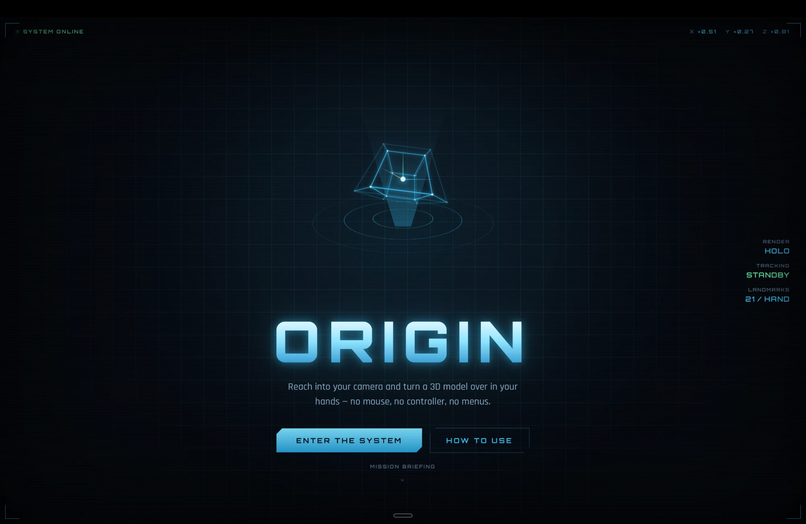

# Origin

**Reach into your webcam and pull a 3D model out of the air.** Pinch a part and carry it in your hand.
Point at a piece and it names itself. Make a fist and turn the whole thing over. Pull two fists apart and it
blows into an exploded diagram. No mouse, no touchpad, no LLM — a laptop camera and hand-written geometry.

Think of the holo-table scenes where someone turns a model over in mid-air. This is a small, real, running
version of that, and every gesture is decided by math I can point to line by line.



## Why this isn't an "AI wrapper"

There is no chatbot, no API key, no backend. A pre-trained hand-tracking model (MediaPipe HandLandmarker) is
used **only as a sensor** — it hands me 21 points per hand, every frame, and nothing else. Everything
that turns those points into *control* is geometry I wrote by hand in [`gestures.js`](gestures.js) and
[`main.js`](main.js): what counts as a pinch, how a moving fist becomes rotation, how the gap between two hands
becomes zoom, how a pointing finger picks one part out of a mesh, how a flat palm becomes a cutting plane, and
how the jitter gets smoothed so it feels intentional. **That math is the project** — the model can't do any of
it. To prove it's real and not a demo-day illusion, the math is pulled into a pure module with a test suite
([`gestures.test.js`](gestures.test.js)) that runs in Node with no camera at all.

## The gestures

Eight moves, learned once. Six with one hand, two with both. There's a full illustrated version at
[`howto.html`](howto.html) — the in-app flight manual.

| Gesture | Hand | What it does |
|---|---|---|
| ☝ **Point** | index finger out | Ray from your fingertip finds the nearest part; it lights up and **labels itself**. A short dwell commits the card, so a glance doesn't fire. |
| 🤏 **Pinch** | thumb + index | **Grab the part you're pointing at.** It turns red and sticks to your hand 1:1. Move it anywhere. |
| 🖐 **Open** | release a held part | Drop it — it snaps home. Open it **over the 🗑 dustbin** and the part is removed from the model instead. |
| ✊ **Fist + move** | one closed hand | **Rotate the whole model.** Let go with a flick and it keeps spinning, then eases to rest (momentum). |
| ◧ **Flat palm (held)** | one open palm, steady | **Section cut** — your palm becomes a plane that slices the model open so you can see inside. Turn your palm over to flip which half survives. |
| 👍 **Thumbs-up** | held ~0.7s | Reset everything back to the start. |
| 🖐🖐 **Two palms** | both hands open | **Zoom.** Spread them apart to zoom in, bring them together to zoom out. |
| ✊✊ **Two fists** | both hands closed | **Explode / rebuild** — pull two fists apart to blow the model into its parts; **twist** them like a wheel to roll it. |



*Two fists pulled apart explode the turbofan; point at any piece and it labels itself — inspection and disassembly in the same gesture vocabulary.*

## Everything it does

- **9 demo models, zero setup** — two hand-built procedural models (a multi-part rocket and a cutaway
  turbofan), four detailed showcase models (Iron Man's **Mark VII** armor, an **arc reactor**, the **Taj
  Mahal**, and an **animated gear train** that plays its rig live), and three **4D polytopes** (tesseract,
  16-cell, 5-cell). Multi-part ones come apart when you explode them.
- **Bring your own model** — `.glb` / `.gltf` / `.obj` / `.fbx` / `.stl`, and real **CAD**: `.step` / `.iges`.
  It's read locally in the browser; nothing is uploaded. Off-origin models get auto-centered, scaled, and
  stood on the floor so they never land "somewhere off in space."
- **Three render skins** — Normal, **Holo** (the ghosted blue hologram, on by default), and X-ray (additive,
  see-through).
- **Inspect · carry · remove** — point to identify a part, pinch to pick it up, drop it in the bin to delete it.
- **Section & measure** — a live cut plane and bounding dimensions to read the model like a blueprint.
- **Voice** — say "iron man", "explode", "snapshot"… and **"lock x" / "lock y" / "lock z"** to freeze one
  rotation axis, **"unlock"** to free them all (Web Speech API, another local sensor — still no LLM).
- **Present / Share / Snapshot** — fullscreen the hologram (`F`), copy a link that reproduces the exact demo,
  rotation, zoom, explode state and render mode, or save a PNG.
- **Mouse & keyboard fallback** — no camera? Drag to rotate, scroll to zoom, `[` / `]` to explode. Nothing is
  gated behind the webcam.

## How it works

```
webcam ─▶ MediaPipe HandLandmarker ─▶ pose + gesture math ─▶ three.js transform ─▶ screen
         (21 landmarks per hand)      gestures.js / main.js   rotate · scale · explode · cut · raycast
```

The parts that were actually hard, and how they're solved:

- **A pinch that works at any distance.** Thumb-tip↔index-tip distance is divided by the palm size, so a pinch
  reads the same whether your hand is near the camera or across the room.
- **Telling a pinch from a fist.** A relaxed palm and a fist both put the thumb near the index, so a naive
  pinch metric fires constantly. A real pinch is the thumb landing *on the index specifically* — tips touching
  **and** the thumb clearly nearer the index than the middle finger. That second test is what rejects both
  impostors.
- **A grab that doesn't drop itself.** Once you've pinched a part, tracking flicker used to fling it away. Now
  the grab is a state machine ([`aimStep`](gestures.js)): only a clear open hand — or losing the hand — lets go,
  and removal happens *only* on a deliberate open over the bin, never on a timer.
- **Two-hand roll without the snap.** Twisting two hands rotates the line between them, but the tracker can hand
  you the two hands in swapped order between frames, flipping that line 180°. The roll math unwraps the angle
  across the ±π seam and rejects any jump too big to be a real wrist, so the model never snap-rolls.
- **One camera can't measure depth.** So "push toward the screen to zoom" is unreliable — the gap between two
  hands drives zoom instead. A hardware limit that shaped the whole interaction.
- **A webcam is a mirror.** Move your hand right, the model has to turn right, so X is flipped in both the
  rotation and the on-screen hand skeleton — otherwise everything feels backwards.
- **Raw landmarks jitter.** Gestures set a *target*; every frame the current transform eases toward it (a
  low-pass filter). That one idea is the whole difference between janky and deliberate.

## The fourth dimension

The three 4D shapes are the same idea taken one dimension further. A tesseract has no "real" screen position —
it lives in 4-space — so `main.js` rotates it in the 4D planes (including the XW/ZW ones you can't picture),
then projects **twice**: 4D→3D→2D, each step a perspective divide. Rotating it makes the inner cube swell and
shrink as it passes "through" you. Same hands, same gestures, one more axis.



## Multi-page flow

A short on-boarding path, all static HTML sharing one design system — no framework:

```
index.html  ─▶  howto.html  ─▶  enter.html  ─▶  app.html
JARVIS boot     flight manual   camera + mic     the workshop (loads main.js)
& landing       (8 gestures)    permission gate   everything above happens here
```



## Run it locally

A webcam needs a secure context, which `localhost` provides:

```bash
python3 -m http.server 8000
```

Open <http://localhost:8000>, follow the on-ramp, and allow the camera. With no model loaded you get the
rocket to play with, and the showcase models in [`models/`](models/) — `iron-man_mark_7.glb`,
`arc_reactor.glb`, `taj_mahal.glb`, and `gears_animation.glb` — are one click away in the demo bar. Two tiny
test samples, a multi-part **robot** (`.glb`/`.gltf`/`.obj`) and a single-piece **crystal** (`.stl`), are also
there; regenerate those with `node make_samples.mjs`.

## Test the gesture math

The geometry in `gestures.js` is pure — no camera, no DOM — so it runs and checks itself in Node:

```bash
node gestures.test.js
```

It exercises the pinch metric, the pinch-vs-fist rejection, the grab/carry/remove state machine, the two-hand
roll (including the 180°-swap guard), the palm cut plane, and the auto-fit for uploaded models.

## Tuning

Real cameras and hands vary, so [`main.js`](main.js) opens with a block of constants meant to be tweaked:
`ROT_SPEED`, `ZOOM_SPEED`, `SMOOTH` (lower = smoother but laggier), `MIRROR_X` (flip if rotation feels
backwards), `HAND_SPAN` / `HAND_DEPTH` (how the hand maps into the scene), and `EXPLODE_K`. The physical world
needs a calibration knob a clean model can't guess.

## Stack

Vanilla JS + [three.js](https://threejs.org) + [MediaPipe Tasks Vision](https://ai.google.dev/edge/mediapipe),
plus [occt-import-js](https://github.com/kovacsv/occt-import-js) (OpenCASCADE in WASM) for CAD, all from a CDN
via an import map. No build step, no server, no dependencies to install.

## What I learned

I came in knowing basic JS and wanting to understand three.js and how gesture control actually works under the
hood. The lessons that stuck:

- **Normalize everything to the hand.** A pinch, a point, a thumbs-up — none of them mean anything in raw
  pixels. Dividing by palm size turned "distance in the image" into "distance relative to *this* hand," and
  that one habit is what makes a gesture read the same near or far.
- **The hard bugs were physical, not logical.** A palm and a fist reading as a pinch, a grabbed part flinging
  off on a tracking flicker, the model snap-rolling because two hands swapped order — none showed up in the
  math on paper. They showed up with a real hand in front of a real camera, and each fix is a specific
  geometric test I can now explain.
- **Smoothing is the whole feeling.** Setting a *target* and easing toward it each frame, instead of using the
  raw value, is the difference between a toy and something that feels like it obeys you.
- **Design around the hardware you have.** One camera gives no trustworthy depth, so I stopped fighting it and
  built zoom out of the gap between two hands. The constraint made the interaction better.
- **State machines beat timers.** Making "grab" survive flicker and making "remove" only ever a deliberate act
  meant modelling the interaction as explicit states, not stringing together timeouts and hoping.
- **Projection generalizes.** Once 3D→2D was a matrix and a divide, doing 4D→3D→2D was the *same* idea twice —
  which is how the tesseract happened at all.

Most of the constants in the tuning block exist because something felt wrong until I sat in front of the camera
and tuned it. That debugging — hands and cameras not behaving like the tidy diagram — taught me the most.

## AI-use disclosure

Per the hackathon rules: I used an AI coding assistant (Claude) to scaffold the three.js / MediaPipe boilerplate
and to talk through the gesture-mapping design. I reviewed, ran, and tuned all of it, and I can explain every
part — the pinch metric, the pinch-vs-fist test, the two-hand zoom and roll, the grab/carry/remove state
machine, the palm cut plane, the 4D projection, and the smoothing were the specific things I set out to
understand. The commit history shows it built up piece by piece.


